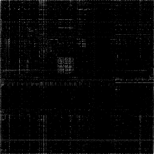

# Digraph Toy



The goal of this is to explore generating digraph images in rust. An arbitrary
file is read into a byte buffer and then iterated across in pairs.  Each
sequential pair of bytes is treated as a coordinate into a 256x256 pixel space.
Each unique pairing is counted up and then all the counts are normalized with a
log scale and then converted back into `u8` space. These values are used to set
a grayscale intensity at a pixel with the same coordinates. 

I started this as a non cargo project just using `rustc` but once I needed the
`image` crate I initialized and so the file structure is a bit un-rustlike.

:notes: :crab: :crab: :crab: :crab: :crab: :notes:

```console
$ cargo run <somefile>
$ xdg-open <somefile>.digraph.png
```

The `samples/` dir is currently empty and ignored by git but thats just where I
have been moving interesting results locally.

## On Images

Images as compessed files do not give particularly interesting results. I'd
like to extend this to extract the raw pixel data from images but really
probably need to support a `trigraph` to look at colorspace.
